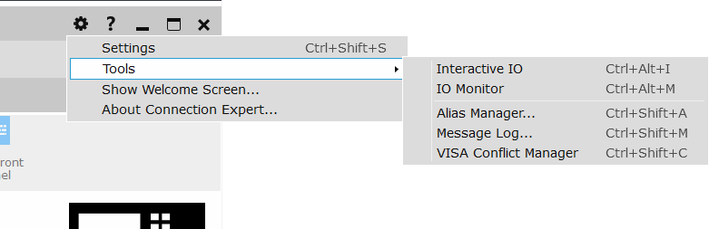
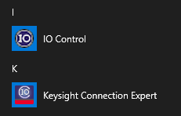

# Keysight IO Libraries Suite

## Basic info

**Tested version:** 18.1.23218

**Installer size:** 260 MB

**DLL name:** `agvisa32.dll` (Keysight used to be Agilent)

**Documentation:** CHM file.

**Examples:** not included in this install. Available as a [separate download](https://www.keysight.com/main/editorial.jspx?cc=US&lc=eng&ckey=2798637&nid=-33002.977662&id=2798637) from Keysight. It's a 1.6 MB zip file, might as well include it in the main installer. Six examples each in C, C#, Matlab, Python, and VB.NET. 

## Discussion

Connection Expert is the main program. There's prominent buttons to launch Interactive IO and IO Monitor tools. The Tools menu has a list of everything - the way it should be.

However, you can't open the documentation from Connection Expert.

### System tray icon

 A system tray program gives a menu with shortcuts to open Connection Expert, open all the utilities, change a few visa options, and open all the help files (.chm).

### Start menu folder

The installer doesn't make a folder in the start menu!

The result is that "IO Control" is under the letter I and "Keysight Connection Expert" is under the letter K. If there were other programs installed starting with I or K installed, that would be extremely annoying.

Also, the start menu doesn't have links to documentation or examples.

## Screenshots

Connection Expert:

Interactive IO:

IO Monitor

Conflict manager (inside Connection Expert):

