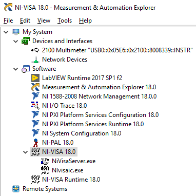
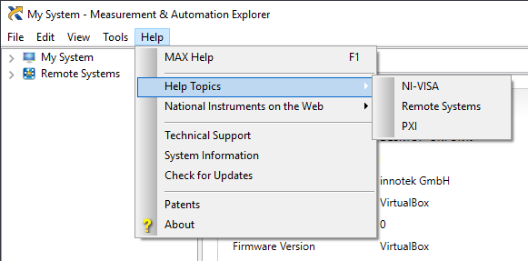
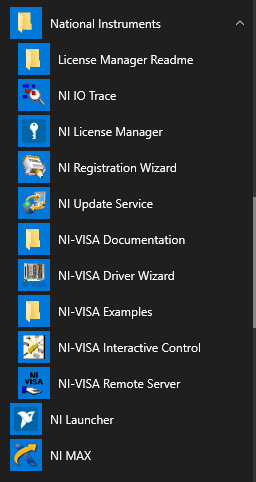
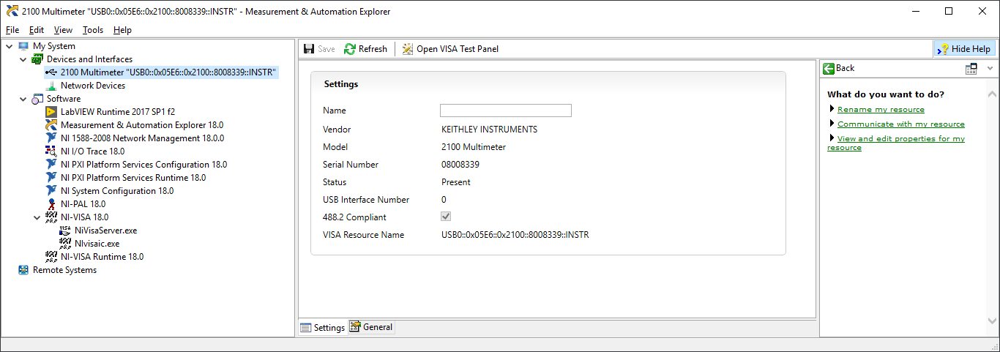
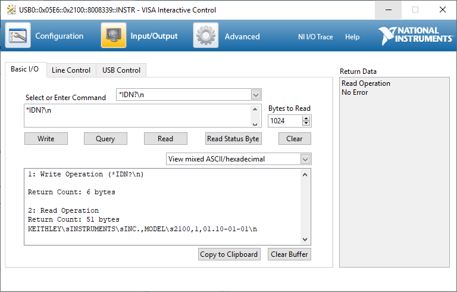
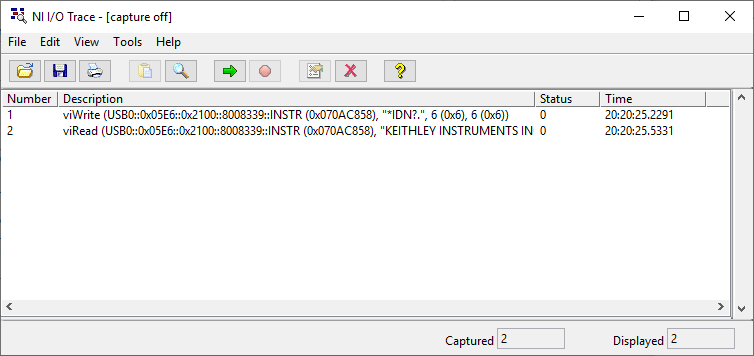

# National Instruments NI-VISA

## Basic info

**Tested version:** 18.0 full

**Installer size:** 732 MB for the "full" installer. The "runtime" installer is only 122 MB. They don't explain what the difference is.

**DLL name:** `nivisa64.dll`

**Documentation:** CHM file.

**Examples:** includes eighteen C examples and five .NET examples.

## Discussion

Most of the action happens in Measurement and Automation Explorer (MAX).

MAX is the hub for [a dozen](https://knowledge.ni.com/KnowledgeArticleDetails?id=kA00Z000000P9KBSA0&l=en-US) devices/protocols supported by NI which makes UI complex. The left sidebar tree has a ton of stuff in it:

The "Devices and Interfaces" tree shows connected instruments, which makes sense.

The "Software" tree is mostly useless. Each item just gives you a table of version, description, and path, except for a page of NI-VISA Options which is hard to get to.

### Integration between tools

MAX can open the Interactive Control utility, which in turn can start I/O Trace. That's about it.

You can open the programming manual from the MAX Help menu:

MAX also has the alias manager inside of it.

### Start menu folder

Handled correctly. There are links to all the tools, documentation, and examples.

## Screenshots

Measurement and Automation Explorer (MAX):

Interactive Control:

I/O Trace:

Conflict Manager inside MAX:

