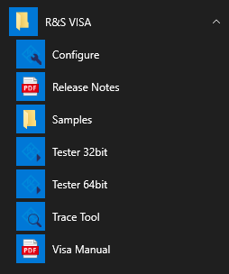
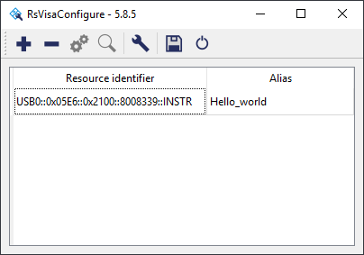

# Rohde & Schwarz RsVisa

## Basic info

**Version tested:** 5.8.5

**Installer size:** 33.7 MB

**DLL name:** `RsVisa32.dll`

**Documentation:** 103-page PDF.

**Examples:** one C# example and one C++ example.

## Discussion

This is a very simple VISA implementation, with a small install size to match. There are just three executables, each without bells & whistles.

### Integration between tools

RsVisaTester has buttons to open RsVisaConfigure and RsVisaTrace.

The conflict manager is inside a "RsVisa Properties" window, which you get to by clicking by clicking on the wrench icon in RsVisaConfigure.

You can't open the programming manual or examples from any of the Help menus.

RsVisaConfigure is also the alias manager.

### Start menu folder

Handled correctly. The installer makes a Start Menu folder with shortcuts to the three RsVisa programs, documentation, and examples.

## Screenshots

RsVisaConfigure:

RsVisaTester:

RsVisaTraceTool:

Conflict Manager (inside RsVisaConfigure):

